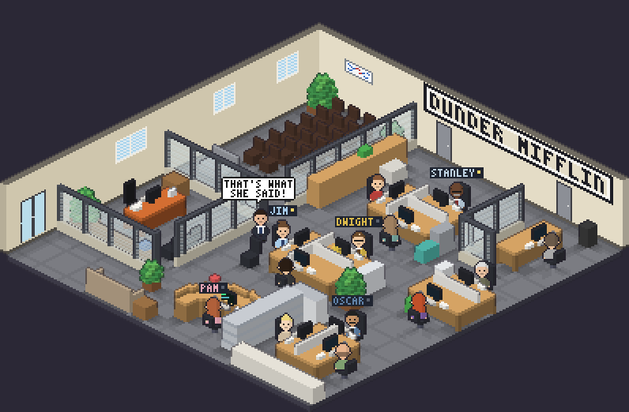

# Scranton Office for Claude Code

A pixel-art Scranton branch office that lives in a terminal pane next to Claude Code.
Everyone is at their desk. When an agent starts working, the character at that desk starts
typing, their monitor lights up and the dot next to their name blinks. Every minute and a half the
regional manager leaves his office, walks over to someone's desk and delivers one of his lines.



## Features

- **Isometric pixel art** rendered with real pixels via [Sixel](https://en.wikipedia.org/wiki/Sixel), with
  the floor plan fans know: the conference room, Michael's glass office, Pam's curved reception desk,
  the Jim/Dwight desks, accounting, Toby's corner, and the sign on the wall.
- **One desk per agent.** The main Claude Code agent sits at Jim's desk; subagents take Dwight, Pam,
  Stanley, Phyllis, Angela, Oscar, Kevin, Andy, Creed, Meredith, Ryan and Toby, in that order.
  Desks are sticky, so nobody changes seats when someone else finishes.
- **Works across sessions.** Run several Claude Code windows and they share one office.
- **Michael is not an agent.** He sits in his office, and about every 95 seconds he walks over and
  delivers a line, such as "That's what she said!" to Jim, "Why are you the way that you are?" to Toby
  or "I declare bankruptcy!" to Oscar.
- **Optional one-line status line** showing who is at work in the current session.

## Requirements

- [Claude Code](https://claude.com/claude-code) with plugin support
- Node.js 18 or newer on your `PATH`
- A terminal with **Sixel** graphics: Windows Terminal 1.22+, WezTerm, iTerm2, foot, mlterm, xterm (`-ti vt340`)
- For automatic split panes: Windows Terminal (with `wta`), tmux or WezTerm. Anywhere else, run the
  viewer yourself in a second pane (see below).
- **tmux users:** tmux only passes Sixel images through if it is version 3.4 or newer, built with
  Sixel support (`tmux -V`, and `sixel` in `tmux display -p '#{client_termfeatures}'`), *and* the
  terminal tmux runs in supports Sixel. Otherwise the pane stays blank apart from the title line.

## Install

```
/plugin marketplace add emrhgnc/claude-scranton-office
/plugin install scranton-office@scranton
```

Restart Claude Code (or run `/hooks`) so the hooks load.

## Usage

| Command | What it does |
|---|---|
| `/scranton-office:office` | Opens the office in a split pane below Claude Code. Run it again to close it. |
| `/scranton-office:statusline` | Installs the one-line status line. It won't overwrite a status line you already have. |
| `/scranton-office:statusline remove` | Removes the status line. |

Inside the office pane, press `q` to quit.

If your terminal isn't one the plugin can split automatically, open a second pane yourself and run:

```
node ~/.claude/plugins/cache/scranton/scranton-office/<version>/scripts/office-view.js
```

`/scranton-office:office` prints the exact path for your install.

## How it works

```
Claude Code hooks ──► scripts/office-hook.js ──► ~/.claude/scranton-office/state/<session>/
                       (UserPromptSubmit, Stop,     busy           main agent is working
                        SubagentStart/Stop, ...)    agents/<id>    one file per running subagent

scripts/office-view.js ──► reads every session's state, assigns desks, renders a frame
                           (scripts/office-art.js), encodes it as Sixel (scripts/sixel.js)
```

- `office-art.js` builds the office from small voxels (1 unit ≈ 12 cm) and projects them
  isometrically. The static scene is rasterized once; each frame adds monitors, characters, labels
  and speech bubbles on top with a depth test.
- Records older than 6 hours are ignored, so an interrupted session can't leave someone stuck at a desk.
- The viewer redraws only when something changes. While Michael is walking it animates at 6 fps.

## Customizing

Everything lives in `plugins/scranton-office/scripts/office-art.js`:

- `SEATS`: who sits where, which way they face, and the order desks are given out
- `CAST`: hair, skin, shirt, tie, glasses and mustache for each character
- `QUOTES` / `ROUTES`: Michael's lines and the path he walks to each person
- `buildWorld()`: the floor plan and furniture

Run `node tools/screenshot.js` to regenerate `docs/screenshot.png` after changes.

## Troubleshooting

- **The pane shows only the title line.** The terminal doesn't render Sixel in that pane. Try
  Windows Terminal 1.22+ or WezTerm.
- **Nobody sits down.** Make sure the plugin is enabled (`/plugin`) and that `node` is on the `PATH`
  Claude Code uses for hooks.
- **The image is too big or too small.** The viewer picks an integer scale that fits the pane.
  Resize the pane and it redraws.

## Disclaimer

This is an unofficial fan project. It is not affiliated with, endorsed by or sponsored by NBCUniversal
or anyone involved with *The Office*. All character names and references belong to their respective
owners and are used here for parody and fan purposes only.

## License

[MIT](LICENSE)
